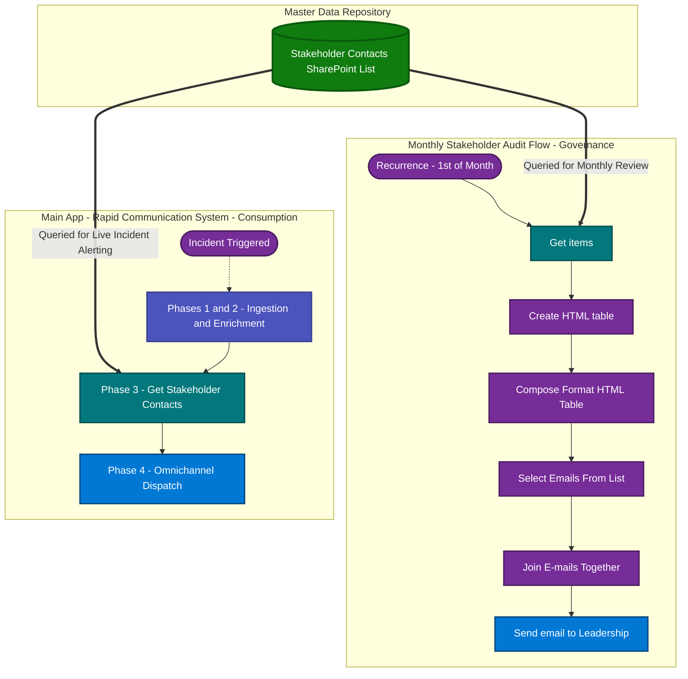

# Monthly Stakeholder Contact Audit Flow

## Overview

The Monthly Stakeholder Contact Audit Flow is an automated governance mechanism deployed via Power Automate. Executing on the first day of each month, this process extracts, formats, and distributes the active critical incident contact roster to organizational leadership for periodic review.

During Major Incidents (P1/P2), precise communication routing is paramount. This workflow ensures that the centralized SharePoint database, which functions as the primary source of truth for SMS, Email-to-Text, and HTML Email alerts, remains highly accurate and strictly governed.


## Business Case & Risk Mitigation

### The Problem of Data Drift

Contact lists are inherently susceptible to data drift. As stakeholders transition into new roles, exit the organization, or modify their mobile carriers, static lists quickly become obsolete. During a critical IT outage, an outdated contact roster introduces severe operational risks. Alert delivery failures directly contribute to delayed decision-making, an increased Mean Time to Resolve (MTTR), and subsequent Service Level Agreement (SLA) breaches.

### The Automated Solution

This architecture mitigates operational risk by replacing manual tracking with a proactive, automated synchronization process. By broadcasting the live database configuration to leadership every 30 days, the system achieves the following critical objectives:

- **Prevents Delivery Failures:** The system ensures that phone numbers and SMS carrier routing metrics are current and functional prior to an actual incident.
- **Enforces Least Privilege:** The periodic review prompts leadership to revoke access for individuals who no longer require visibility into sensitive, confidential operational updates.
- **Eliminates Administrative Overhead:** The process fully automates the extraction, formatting, and distribution of the audit materials, requiring zero manual intervention from the Operations Management Team.

## Industry Standard Alignment

This automated audit facilitates organizational compliance with major information security and governance frameworks:

### ISO/IEC 27001:2022

- **Control 5.24 (Information Security Incident Management Planning):** The automation ensures that designated contact points for incident response are continuously maintained and readily available for emergency use.  
- **Control 5.18 (Access Rights):** The process directly enables and records the regular review of access rights pertaining to sensitive corporate communications.

### NIST SP 800-53 (Rev. 5)

- **IR-4 (Incident Handling):** The workflow guarantees that incident handling activities are coordinated with the correct, authorized internal personnel.  
- **AC-2 (Account Management):** The automated review process satisfies the requirement for periodic auditing of distribution lists, group memberships, and system access.

## System Architecture

The Power Automate workflow (Audit-ExecutiveContacts.json) is designed for simplicity, reliability, and low latency. The execution model follows a strict linear sequence:

### 1. Initialization (Recurrence)

The process is initiated via a time-based trigger, executing automatically on the first day of each month at 09:00 AM EST.

### 2. Data Retrieval

The workflow executes a query against the master SharePoint Stakeholder Contacts list to retrieve the most current data array.

### 3. Data Formatting

The system extracts the Name, Email, Phone Number, and Carrier values from the JSON array. It subsequently injects inline CSS to parse and format the raw data into an enterprise-styled HTML grid.

### 4. Audience Compilation

Utilizing Select and Join operations, the workflow dynamically constructs the email recipient list directly from the queried dataset, ensuring the audit is delivered exclusively to the current stakeholders.

### 5. Dispatch

The finalized HTML payload is transmitted to the generated recipient list via a designated, shared Office 365 Operations mailbox.

## Flow Diagram


## Email Payload Preview

**Subject:** Situation Manager Alert Contact List – [Current Month] [Year] – Audit

### Rendered Email Body

Dear Leadership Team,

This is an automated Monthly Review of the distribution list used for alerts related to major incident engagements.

Please review the attached information carefully. It is essential that this list remains accurate, as it is used to distribute time-sensitive and confidential updates during critical situations.

If any updates are needed, such as adding, removing, or editing contact details or individuals, please report them promptly to the Operations Management Team.

Maintaining the accuracy of this list is vital to ensure the right people receive the necessary alerts when incidents occur.

| Name           | E-mail                   | Phone Number | Carrier   |
|----------------|--------------------------|--------------|-----------|
| Jane Doe       | jane.doe@example.com     | 555-0101     | Verizon   |
| John Smith     | john.smith@example.com   | 555-0102     | T-Mobile  |
| Operations DL  | ops-dl@example.com       | DISTRO       | DISTRO    |
| Security Team  | sec-alerts@example.com   | 555-0103     | AT&T      |

Thank you for your attention to this matter and for helping us uphold operational effectiveness and data sensitivity.

Kind regards,  
Operations Center Automation

## Source HTML Template

```html
<p style="margin-bottom: 6px;">Dear Leadership Team,</p>

<p style="margin-bottom: 6px;">
This is an <strong>automated Monthly Review</strong> of the distribution list used for alerts related to major incident engagements.
</p>

<p style="margin-bottom: 6px;">
Please review the attached information carefully. It is essential that this list remains accurate, as it is used to distribute <strong>time-sensitive and confidential updates</strong> during critical situations.
</p>

<p style="margin-bottom: 6px;">
If any updates are needed, such as <strong>adding, removing, or editing</strong> contact details or individuals, please report them promptly to the Operations Management Team.
</p>

<p style="margin-bottom: 6px;">
Maintaining the accuracy of this list is vital to ensure the right people receive the necessary alerts when incidents occur.
</p>

<!-- DYNAMIC HTML TABLE INJECTED HERE -->
@{outputs('Compose_Format_HTML_Table')}

<p style="margin-top: 10px;">
Thank you for your attention to this matter and for helping us uphold operational effectiveness and data sensitivity.
</p>

<p style="margin-top: 6px;">
Kind regards,<br><br>
Operations Center Automation
</p>
```
## Deployment Instructions

<ol>1. Package Import

Import the provided Audit-ExecutiveContacts.json payload into your designated Power Automate environment.

<ol>2. Connection Authentication

Authenticate the shared_sharepointonline connector with an account possessing read-only permissions to the target Stakeholder Contacts list. Authenticate the shared_office365 connector with an account possessing Send-As privileges for the centralized Operations mailbox.

<ol>3. Configuration Updates

Map the Get_items action parameters to your specific SharePoint Site URL and List ID. Finally, verify that the Reply-To address in the dispatch action correctly routes to your internal IT Support or Operations distribution list.
