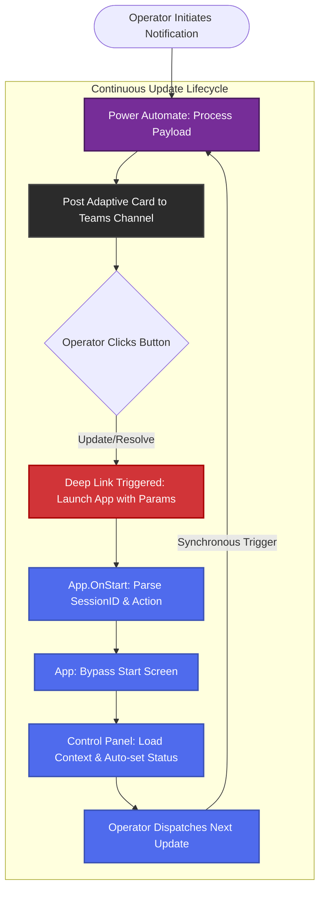

# Omnichannel State Persistence Through Adaptive Cards

## Leveraging Adaptive Cards & Deep Links for High-Velocity Incident Response

### Overview

The **Executive Notification System (ENS)** utilizes Microsoft Teams Adaptive Cards as a "Digital Receipt" and a "Stateful Switch." In high-pressure incident management, sending a notification is only half the battle; the other half is ensuring the operator knows the message was delivered and that subsequent updates can be dispatched with minimal friction.

By integrating **Adaptive Cards** into critical communication channels, the system creates a centralized operational narrative that informs stakeholders while providing the operator with a surgical interface for lifecycle updates.


### 1\. The Business Case: The Operational Feedback Loop

The posting of an Adaptive Card serves three primary strategic purposes:

- **Operator Confirmation:** In a high-latency environment, the appearance of the card in a Teams channel acts as an immediate visual confirmation that the Power Automate backend has successfully processed and dispatched the omnichannel alerts (Email, SMS, and Teams).
- **Situational Awareness:** For other responders working in the "War Room" or technical channels, the card provides a real-time summary of the executive-level narrative, ensuring technical and managerial teams remain synchronized.
- **Frictionless Lifecycle Management:** Through embedded deep links, the card transforms from a passive notification into an active control interface. It allows any authorized manager to take over an incident update with a single click.

### 2\. Deep Link Architecture: The "Stateful Handshake"

The "Magic" of the ENS lies in its ability to bypass standard navigation and pre-configure the workspace based on external intent. This is achieved through a specific **Deep Link Protocol**.

#### How the Deep Link Functions

When a manager clicks a button on the Adaptive Card (e.g., **"Resolve"**), the system generates a URL that carries the incident's "DNA" back to the Power App:

<https://apps.powerapps.com/play/{AppID}?tenantId={TenantID}&SessionID={GUID}&Action=Resolve&source=Teams>

- **Session Ingestion:** The app detects the SessionID. This GUID is the immutable primary key stored in the IncidentNotificationLogger list.
- **Intent Parsing:** The Action parameter (Update, Resolve, Disengage) tells the app exactly what the user intends to do.
- **UI Configuration:** The app logic skips the Start Screen, loads the specific record context, and automatically sets the **Status** dropdown to match the intent (e.g., setting the status to "Resolved").

### 3\. Visual Behavioral Logic: The Deep Link Cycle

The following flowchart illustrates the transition from the automated notification dispatch to the human-initiated lifecycle update.



### 4\. Technical Implementation Reference

#### A. Adaptive Card Callback Configuration (Power Automate JSON)

This segment shows how the SessionID variable and the incident metadata are dynamically injected into the Teams card actions to create the stateful link.
```
{  
"type": "ActionSet",  
"actions": \[  
{  
"type": "Action.OpenUrl",  
"title": "✅ Resolve",  
"url": "\[<https://apps.powerapps.com/play/\>](<https://apps.powerapps.com/play/){AppID}?tenantId={TenantID}&SessionID=@{variables('SessionID')}&Action=Resolve&source=Teams>"  
},  
{  
"type": "Action.OpenUrl",  
"title": "☎️ Join Incident Bridge",  
"url": "@{body('Parse_JSON')?\['Bridge'\]}",  
"style": "positive"  
}  
\]  
}
```
#### B. Deep Link Ingestion Logic (App.OnStart)

This logic runs the moment the app is launched via the card. It distinguishes between a "Normal Load" and a "Deep Link Load."
```
If(  
!IsBlank(Param("SessionID")),  
// Logic: Session Found, sync the workspace  
Set(varCurrentSessionID, Param("SessionID"));  
Set(varCurrentAction, Param("Action"));  
Set(varSelectedRecord, LookUp(IncidentNotificationLogger, SessionID = varCurrentSessionID));  
Set(varMode, "Existing");  
Set(varFromDeepLink, true),  
<br/>// Logic: Standard entry path  
Set(varMode, "New");  
Set(varFromDeepLink, false)  
)
```
#### C. Contextual UI Mapping (Control Panel Status)

The Default property of the Status Dropdown in the Control Panel ensures the UI reflects the intent passed by the card.

```
Default:  
If(  
!IsBlank(varCurrentAction),  
// Switch state based on Teams button clicked  
Switch(varCurrentAction,  
"Resolve", "Resolved",  
"Disengage", "Disengaged",  
"Update", "Update",  
"Active"  
),  
// Fallback to current database state  
Coalesce(varSelectedRecord.State, "Active")  
)
```
### 5\. Conclusion

The integration of Adaptive Cards and Deep Links transforms the ENS from a simple notification tool into a sophisticated **Incident State Engine**. By embedding the incident's "DNA" into the communication stream, we reduce the "Time-to-Update" from minutes to seconds, ensuring that executive stakeholders receive a continuous, professional narrative as the incident evolves.
