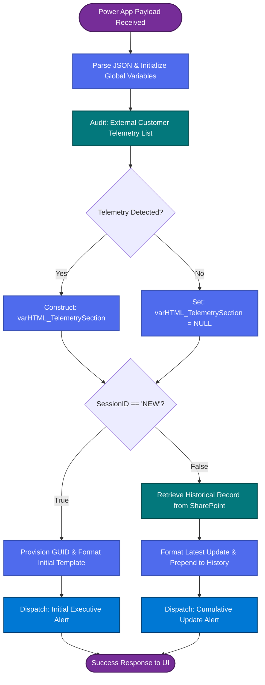
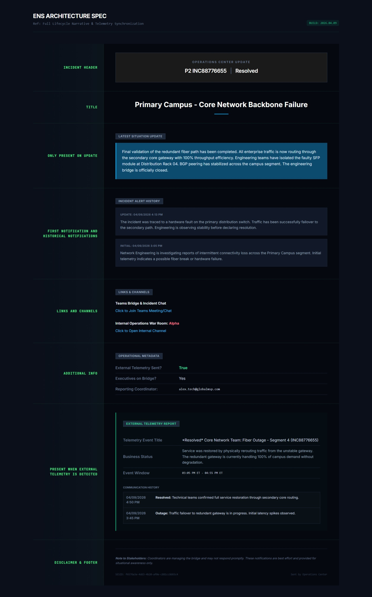

# Dynamic Email Architecture

## Engineering Modular Notification Templates for Executive Consumption

### Overview

While real-time collaboration platforms like Microsoft Teams facilitate operational agility, **Email** remains the authoritative medium for executive-level communication. The Executive Notification System (ENS) utilizes a modular HTML/CSS architecture within Power Automate to generate dynamic, "single-source-of-truth" narratives.

The primary design challenge was to move away from fragmented, multi-threaded email chains. The solution was a **cumulative update model**: a single email template that dynamically injects historical data, external telemetry, and technical specifics based on the current state of the incident lifecycle.


### 1\. Architectural Logic Orchestration

The following flowchart delineates the backend decision-making process within the Power Automate orchestration engine. It illustrates how the system evaluates the incident state and external data availability to determine the composition of the modular email sections.

### 2\. Structural Breakdown: The Modular Layout

The ENS email is divided into logical segments that serve specific informational tiers. This ensures that a recipient can consume the most critical data in under 10 seconds.



#### A. The Incident Header & Title (Fixed Metadata)

- **Design Goal:** Immediate situational awareness.
- **Content:** The high-contrast header displays the **Priority**, **Incident Number**, and **Lifecycle State** (e.g., Resolved, Active). The Title uses bold typography to define the "what" and "where" of the event.

#### B. Latest Situation Update (Conditional Block)

- **Operational Logic:** This block is dynamically injected only during "Update" or "Resolved" actions.
- **UX Intent:** By separating the _newest_ information into a blue-themed callout box, we ensure that returning stakeholders do not have to hunt through a long narrative to find what has changed since the last alert.

#### C. The Cumulative Narrative (Incident History)

- **State Persistence:** One of the most advanced features of the system is the **Recursive History Logger**. Every time a notification is sent, the system retrieves the previous History string from the SharePoint record and prepends the new update.
- **Result:** The email effectively becomes a chronological log, allowing an executive who joins mid-incident to see the entire timeline within a single message.

### 3\. External Telemetry Integration (Dynamic Injection)

The most technically complex segment of the email is the **External Telemetry Report**. This section is not static; it is governed by an automated audit of external data sources.

#### The "Audit-and-Inject" Workflow

- **Detection:** As the flow triggers, it performs an OData query against the **External Customer Telemetry** list.
- **Logic Gate:** A boolean variable, varCalculatedTelemetryStatus, is set to True only if a matching record exists for the current INC number.
- **Dynamic HTML Construction:** If the gate is open, the system builds an entire HTML table (varHTML_TelemetrySection) containing start/end times and business segment impact.
- **Placeholder Injection:** The main email body contains a variable placeholder. If no telemetry is found, the variable is null and the section simply does not render, keeping the email clean and relevant.

### 4\. Technical Implementation Reference (Power Automate HTML)

The following segments illustrate the modular CSS and HTML construction used within the Compose actions of the notification flow.

#### A. Dynamic History Prepending (SharePoint Patch Logic)

This logic ensures the historical log stays cumulative without breaking the HTML structure.
```
// Formula for updating the SharePoint History field
// New entry is wrapped in a styled div and prepended to the existing string
"<p class='editor-paragraph'>@{outputs('Format_New_Notification_Entry')}</p>" + 
"@{item()?['History']}"
```
#### B. The Conditional Telemetry Block (HTML Variable)

The system builds this string only when a telemetry match is detected, using standard inline CSS for email client compatibility.
```
<!-- varHTML_TelemetrySection -->
<div class="section-header">EXTERNAL TELEMETRY REPORT</div>
<table style="width: 100%; border-collapse: collapse;">
    <tr>
        <td style="padding: 8px 0; border-bottom: 1px solid #eeeeee; width: 30%;">
            <strong>Telemetry Event Title:</strong>
        </td>
        <td style="padding: 8px 0; border-bottom: 1px solid #eeeeee;">
            @{variables('varTelemetry_Record')?['Title']}
        </td>
    </tr>
    <!-- Additional rows follow for Status, Segment, and Timestamps -->
</table>
```
#### C. Responsive Header Bar (Inline CSS)
```
<td class="header-bar" style="background-color: #2b2b2b; padding: 20px 15px; text-align: center;">
    <p class="header-text" style="color: #ffffff; font-size: 20px; font-weight: bold; text-transform: uppercase;">
        Situation Manager Update
    </p>
</td>
```

### 5\. Conclusion

The ENS Email Architecture moves beyond the "standard alert" by functioning as a dynamic data aggregator. By modularizing the template, the system ensures that executives receive exactly the right amount of context-no more, no less-maintaining high-level situational awareness throughout the incident lifecycle.
