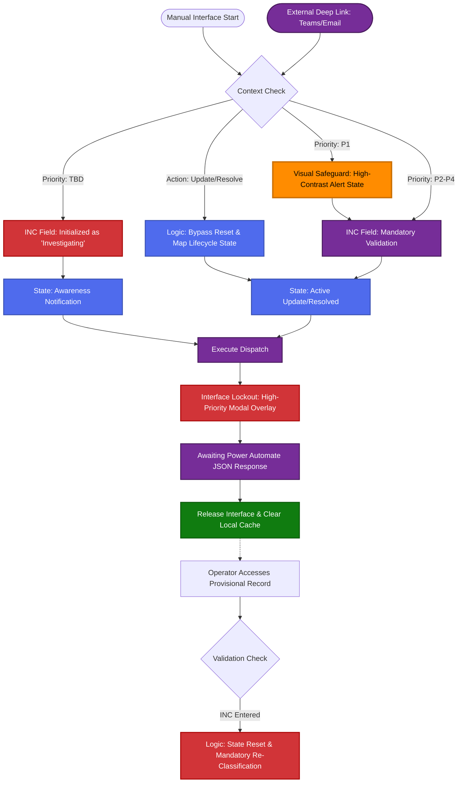

# The Communications Control Panel

## Optimizing Operational Discipline through Context-Aware Interface Design


### Overview

The **Communications Control Panel** (Control Panel) functions as the central command interface for the Executive Notification System (ENS). Within the high-velocity environment of a Global Managed Service Provider (MSP), the primary challenge involves more than data transmission; it requires ensuring that all disseminated information is accurate, timely, and professionally structured under significant operational pressure.

In contrast to conventional data-entry forms, the Control Panel is engineered as a **Decision Support System**. It accounts for the inherent ambiguity typical of early-stage crisis response and provides a structured methodology for transitioning from initial investigation to formal resolution. The design is predicated on three architectural pillars: **Data Integrity**, **Operational Velocity**, and **Automated State Reconciliation**.

### 1\. Behavioral Logic Orchestration & Deep Link Integration

The logic governing the Control Panel is a convergence of manual provisioning and automated state synchronization. The following flowchart delineates how the interface reconciles incoming strategic intent-whether from a manual entry or a deep-linked external trigger-with system-defined guardrails.


#### Operator-System Synergy

The user interaction model is designed to minimize cognitive load while maximizing professional rigor. The journey typically follows one of two paths:

- **The Proactive Provisioning Path:** An operator initiates a notification during the "Fog of War." Upon selecting a **TBD** priority, the system proactively locks the incident identifier to prevent the dissemination of inaccurate ticket numbers. The operator is guided to focus solely on the business impact narrative.
- **The Automated Lifecycle Path:** Later, a manager receives a Teams notification and clicks the "Resolve" button. The deep-link bypass logic intercepts this intent, bypasses the home screen, and pre-configures the Control Panel. The operator arrives to find the status already set to "Resolved," the incident history pre-loaded, and the "TBD Trap" automatically released if a valid identifier was previously reconciled.

This synergy ensures that the system anticipates the operator's next move based on the stage of the incident lifecycle.

### 2\. Validation Logic & Professional Guardrails

To ensure that no notification is dispatched with incomplete or unprofessional data, the system employs several layers of validation and input sanitization.

#### A. The "Send Safe" Validation Protocol

The primary "Send Notification" action is governed by a strict validation matrix. The button remains in a Disabled state until all mandatory attributes-including Priority, Incident Title, Narrative, and Stakeholder selection-are successfully populated. To assist the operator under pressure, all mandatory fields are dynamically identified by high-contrast **red borders** which resolve to the corporate primary color once valid data is detected.

#### B. Identifier Sanitization & Input Standardization

The Incident Number input box utilizes an automated sanitization routine to maintain data consistency across external telemetry platforms.

- **Standardization:** All inputs are automatically converted to uppercase and whitespace is stripped to prevent "Broken Link" errors in downstream automations.
- **Length Verification:** The system enforces specific character limits (e.g., 11 characters for standard INC identifiers) to prevent partial pasting or truncated identifiers from compromising reporting accuracy.
- **Prefix Reinforcement:** The logic ensures that all identifiers adhere to the "INC" or "CHG" prefix requirements, rejecting non-standard nomenclature.

### 3\. Automated State Validation: Major Incident Verification

A critical risk in major incident management is the failure to verify if internal communications have been disseminated to technical providers. Manually checking an external telemetry bridge or an inbox during a crisis is a known failure point for human operators.

#### The "External Customer Telemetry" Automation

The system solves this through an integrated Power Automate flow that performs a real-time audit of the external customer telemetry SharePoint lists.

- **Automated Audit:** When an incident is loaded, the backend automatically queries for the existence of an External Customer Telemetry Report associated with that specific Incident Number.
- **The Major Flag:** If the system detects a published telemetry report, it automatically flags the event as an "Official Major Incident" within the UI. This eliminates the need for manual verification by the SitMan, ensuring that executive notifications are only categorized as "Major" once the external customer telemetry is confirmed.

### 4\. Synchronous Transaction Logic With The Operational Lockout

Within critical notification systems, opaque backend processes frequently lead to operator error. If a user executes a dispatch and the interface provides insufficient feedback, there is a heightened risk of redundant notifications being sent to senior leadership.

#### A. The Comprehensive Interface Lockout

Upon engagement, the system activates a high-priority modal overlay. This component physically intercepts all input events, ensuring that the operator remains focused on the pending transaction and cannot modify data while it is being transmitted.

#### B. The Psychological Progress Indicator

To mitigate operational uncertainty, the lockout mechanism incorporates a visual progress indicator with a timer. This provides real-time confirmation that the multi-channel orchestration (Teams, Email, SMS) is proceeding as expected.

#### C. The Success-Response Handshake

The lockout is terminated only upon the receipt of a specific success status from the Power Automate workflow. In the event of an error, the interface is released but the data is preserved, allowing for immediate remediation without loss of content.

### 5\. Deep Link State Engine: Strategic Intent

Standard deep links primarily facilitate navigation; however, within the ENS, they carry **Strategic Intent**. The application interprets the required outcome prior to rendering the interface for the user.

- **Lifecycle Mapping:** The system utilizes URL parameters to pre-configure the workspace state. For example, a "Resolution" intent automatically validates necessary end-state attributes.
- **State Persistence:** To prevent a new session from inheriting residual data, the system employs a state-aware flag (varFromDeepLink).

### 6\. Priority Classification & Visual Safeguards

Accuracy in priority classification is essential for maintaining organizational trust. Over-classification leads to stakeholder fatigue, while under-classification may result in a catastrophic failure of crisis awareness.

#### The Strategic Visual Interrupt

When a **Priority 1 (P1)** classification is selected, the interface triggers an **Active Orange Highlight** in the priority field.

- **Objective:** To introduce "Cognitive Friction."
- **Result:** The color shift necessitates a secondary validation, ensuring that P1 alerts-which mobilize executive leadership-are deliberate and accurate.

### 7\. Technical Implementation Reference (Power Fx & JSON)

#### A. "Send Safe" Validation Matrix (Button_Send.DisplayMode)

This formula ensures the "Send" action is only available when the mandatory data set is professionally finalized.
```
DisplayMode: If(  
!IsBlank(TextInput_INC.Text) &&  
!IsBlank(TextInput_Title.Text) &&  
!IsBlank(TextInput_Notification.Text) &&  
!IsBlank(TextInput_BridgeLink.Text) &&  
Dropdown_Priority.Selected.Value <> "Priority" &&  
Dropdown_InternalChannel.Selected.Value <> "Select Internal Channel" &&  
CountRows(ComboBox_Executives.SelectedItems) > 0,  
DisplayMode.Edit,  
DisplayMode.Disabled  
)
```
#### B. Automated INC Sanitization (TextInput_INC.OnChange)

Standardizes input to ensure parity with external telemetry databases.
```
// Data Sanitization Routine  
UpdateContext({  
ctxCleanInput: Substitute(Upper(Self.Text), " ", "")  
});  
<br/>// Enforce Length and Structure Consistency  
UpdateContext({  
ctxFinalInput: If(  
StartsWith(ctxCleanInput, "CHG"),  
Left(ctxCleanInput, 10),  
Left(ctxCleanInput, 11)  
)  
});  
<br/>Set(varTempINC, ctxFinalInput);
```
#### C. Automated External Customer Telemetry Verification (Power Automate logic)

The backend logic that automates the verification of "Major" status flags via external data sources.
```
// OData Filter Query to verify External Customer Telemetry existence  
{  
"method": "GET",  
"path": "/\_api/web/lists/getbytitle('CustomerTelemetryList')/items",  
"queries": {  
"\$filter": "INC eq '@{body('Parse_JSON')?\['INC'\]}'",  
"\$orderby": "ID desc",  
"\$top": 1  
}  
}  
<br/>// Logic: varCalculatedTelemetryStatus (Boolean)  
// Initialized in App as: @greater(length(outputs('Get_items_CustomerTelemetry')?\['body/value'\]), 0)
```
#### D. Dynamic Mandatory Field Highlighting (BorderColor)
```
// Logic applied to all mandatory input controls  
BorderColor: If(  
IsBlank(Self.Text) || Self.Selected.Value = "Priority",  
Color.Red,  
RGBA(0, 89, 178, 1) // Standard Corporate Blue  
)
```
#### E. Transactional Dispatch Handshake (Button_Send.OnSelect)
```
UpdateContext({ locProcessing: true });  
<br/>Set(varFlowStatus, ExecutiveNotificationAppCollector.Run(  
JSON({  
INC: Upper(TextInput_INC.Text),  
SessionID: Coalesce(varSelectedRecord.SessionID, "NEW"),  
CustomerTelemetry: Checkbox_CustomerTelemetry.Value // Automated flag from Step 3  
})  
));  
<br/>If(varFlowStatus.status = "Complete", UpdateContext({ locProcessing: false }));
```
