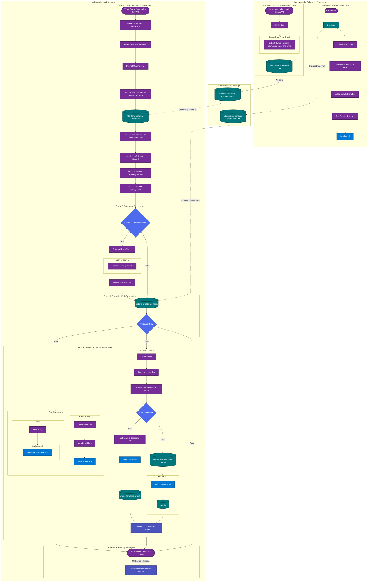

```mermaid
flowchart TD
    %% Power Automate Color Palette
    classDef trigger fill:#762d98,color:#fff,stroke:#4a1c5e,stroke-width:2px;
    classDef variable fill:#762d98,color:#fff,stroke:#4a1c5e,stroke-width:2px;
    classDef sharepoint fill:#03787c,color:#fff,stroke:#014d4f,stroke-width:2px;
    classDef control fill:#4f6bed,color:#fff,stroke:#3b52b4,stroke-width:2px;
    classDef email fill:#0078d4,color:#fff,stroke:#004578,stroke-width:2px;
    classDef teams fill:#4b53bc,color:#fff,stroke:#393f8f,stroke-width:2px;
    classDef fail fill:#d13438,color:#fff,stroke:#a80000,stroke-width:2px;

    %% ==========================================
    %% TIER 1: BACKGROUND & SCHEDULED PROCESSES
    %% ==========================================
    subgraph BackgroundFlows [Background & Scheduled Processes]
        direction TB

        subgraph ParallelFlow [Asynchronous Telemetry Listener Flow]
            direction LR
            EmailTrig([When a new alert email arrives V3]):::trigger --> HTML2Text[Html to text]:::variable
            HTML2Text --> ExtractContainer
            
            subgraph ExtractContainer [Extract Data From E-mail]
                ExtractActions[Extract Status, Incident, Segments, Times and Links]:::variable
            end
            
            ExtractContainer --> CreateTelemetry[(Create item in Telemetry List)]:::sharepoint
        end

        subgraph AuditFlow [Monthly Stakeholder Audit Flow]
            direction LR
            Recurrence([Recurrence]):::trigger --> AuditGetItems[Get items]:::sharepoint
            AuditGetItems --> AuditHTML[Create HTML table]:::variable
            AuditHTML --> AuditFormat[Compose Format HTML Table]:::variable
            AuditFormat --> AuditSelect[Select Emails From List]:::variable
            AuditSelect --> AuditJoin[Join E-mails Together]:::variable
            AuditJoin --> AuditSend[Send email]:::email
        end
    end

    %% ==========================================
    %% TIER 2: SHARED DATABASES
    %% ==========================================
    subgraph Databases [Centralized Data Storage]
        direction TB
        SharedDB[(External Telemetry SharePoint List)]:::sharepoint
        ContactDB[(Stakeholder Contacts SharePoint List)]:::sharepoint
        
        %% Enforce vertical stacking
        SharedDB ~~~ ContactDB
    end

    %% Link Background Processes down to Databases to force layout centering
    CreateTelemetry -->|Writes to| SharedDB
    AuditGetItems -.->|Queries Data From| ContactDB


    %% ==========================================
    %% TIER 3: MAIN APPLICATION EXECUTION
    %% ==========================================
    subgraph MainApp [Main Application Execution]
        direction TB

        subgraph Phase1 [Phase 1: Data Ingestion & Initialization]
            direction TB
            Start([When Power Apps calls a flow V2]):::trigger --> Parse[Parse JSON From PowerApp]:::variable
            Parse --> Init1[Initialize Variable SessionID]:::variable
            Init1 --> Map[Internal Channel Map]:::variable
            Map --> Init2[Initialize and Set Variable Internal Chat Link]:::variable
            Init2 --> SP1[(Get items External Telemetry)]:::sharepoint
            SP1 --> Init3[Initialize and Set Variable Telemetry Check]:::variable
            Init3 --> Init4[Initialize varTelemetry Record]:::variable
            Init4 --> Init5[Initialize varHTML TelemetrySection]:::variable
            Init5 --> Init6[Initialize varHTML HistoryRows]:::variable
        end

        subgraph Phase2 [Phase 2: Contextual Enrichment]
            direction TB
            Cond1{Condition Telemetry Found}:::control
            
            Cond1 -->|True| SetObj[Set variable as Object]:::variable
            
            SetObj --> Loop1Container
            
            subgraph Loop1Container [Apply to each 1]
                Append[Append to string variable]:::variable
            end
            
            Loop1Container --> SetHTML[Set variable as HTML]:::variable
        end

        subgraph Phase3 [Phase 3: Production Flow Preparation]
            direction TB
            SP2[(Get Stakeholder Contacts)]:::sharepoint --> ProdFlow{Production Flow}:::control
        end

        subgraph Phase4 [Phase 4: Omnichannel Dispatch & State]
            direction TB

            subgraph ScopeEmail [Email Notification]
                direction TB
                SelectE[Select Emails]:::variable --> JoinE[Join emails together]:::variable
                JoinE --> FormatN[Format New Notification Entry]:::variable
                FormatN --> CondFirst{First Notification}:::control
                
                CondFirst -->|True| SetNew[Set variable SessionID NEW]:::variable
                SetNew --> SendFirst[Send First Email]:::email
                SendFirst --> CreateTracker[(Create item Tracker List)]:::sharepoint
                
                CondFirst -->|False| GetHist[(Get items Notification History)]:::sharepoint
                GetHist --> LoopForEach1
                
                subgraph LoopForEach1 [For each 1]
                    direction TB
                    SendUp[Send Update email]:::email --> UpItem[(Update item)]:::sharepoint
                end
                
                CreateTracker --> PostCard1[Post card in a chat or channel]:::teams
                LoopForEach1 --> PostCard1
            end

            subgraph ScopeText [Text Notification]
                direction TB
                
                subgraph ScopeE2T [Email to Text]
                    direction TB
                    SelE2T[SelectEmail2Text]:::variable --> JoinE2T[Join Email2Text]:::variable
                    JoinE2T --> SendE2T[Send Email2text]:::email
                end
                
                subgraph ScopeTwilio [Twilio]
                    direction TB
                    FilterT[Filter array]:::variable --> LoopTwilio
                    
                    subgraph LoopTwilio [Apply to each]
                        SendSMS[Send Text Message SMS]:::email
                    end
                end
            end
        end

        subgraph Phase5 [Phase 5: Resiliency & Lifecycle]
            direction TB
            Respond([Respond to a Power App or flow]):::trigger
            FailPost[Post card with flow bot on Failure]:::teams
        end
    end

    %% Link Databases down into the Main App
    SharedDB -.->|Queried by Main App| SP1
    ContactDB -.->|Queried by Main App| SP2

    %% INTER-PHASE ROUTING (Inside Main App)
    Init6 --> Cond1
    Cond1 -->|False| SP2
    SetHTML --> SP2

    ProdFlow -->|True| ScopeEmail
    ProdFlow -->|True| ScopeText
    ProdFlow -->|False| Respond

    ScopeEmail --> Respond
    ScopeText --> Respond

    Respond -.->|On Failure / Timeout| FailPost
```
