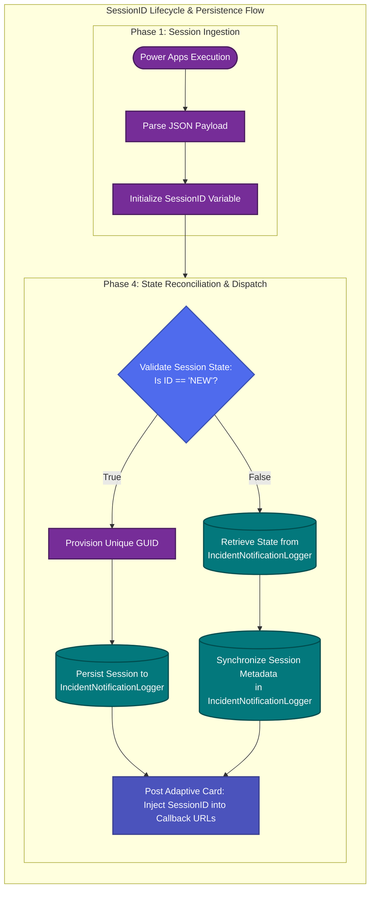

# The Case for SessionID Over Incident Numbers

## Overview

In high-pressure Incident Management (IM) environments, the speed of the "Initial Notification" is often the primary KPI. However, binding a notification flow directly to a specific Incident Number creates a rigid architecture that fails in complex, multi-tenant, or Managed Service Provider (MSP) scenarios.

This article outlines why we have transitioned to a SessionID-based tracking model to ensure telemetry integrity and continuity of communication.

## The Problem: The "Incident Number" Trap

Traditionally, systems use the Incident ID (e.g., INC12345) as the primary key for a notification thread. While this seems logical, it creates a critical failure point: The Binding Constraint.

1. The Telemetry Mismatch

Automations often sync with external data sources, such as SharePoint telemetry lists or client-side dashboards. If an operator initiates a flow with INC12345, the automation expects that ID to persist. If the ID changes, the link between the internal notification and the external telemetry record is broken.

2. "Update" vs. "New Flow" Logic

If an Incident Number must be changed mid-stream to match a customer's records, most automation engines interpret this change as the termination of the current flow and the creation of a brand-new incident.

The Result: Stakeholders see a "New Incident" notification instead of an "Update," leading to confusion and fragmented reporting.

The Risk: History, timestamps, and the "time-to-resolution" (TTR) clock may reset or bifurcate.

## Context: The Multi-Tenant & MSP Reality

In a single-tenant environment, the internal team usually has total control over incident numbering. However, for MSPs operating in multi-tenant environments, power dynamics shift:

Customer Dictation: Customers often have their own internal tracking systems. If they decide that a different incident number is the "Source of Truth," the MSP must adapt.

The Scramble: During the "Fog of War," incident managers grab the first available reference number to get the word out.

Competing Teams: In complex environments, duplicate incidents are often created. When these are merged, the notification flow must survive the transition.

## The Solution: SessionID Architecture

By generating a unique, immutable SessionID at the moment the notification flow is triggered, we decouple the communication event from the incident record.

Workflow Logic: State Persistence & Reconciliation

The following diagram illustrates the lifecycle of a notification session, detailing how the IncidentNotificationLogger serves as the authoritative source of truth for session continuity.

## Core Architectural Orchestration

Session Ingestion (Phase 1): The flow intercepts the SessionID attribute from the Power App. For greenfield notifications, the system recognizes a "NEW" flag, triggering the provisioning logic.

State Reconciliation (Phase 4):

Session Provisioning: If flagged as new, the system executes Set_variable_SessionID_NEW to generate a cryptographic GUID. This GUID is persisted to the IncidentNotificationLogger SharePoint list, establishing the immutable primary key for the event’s lifecycle.

Session Synchronization: For updates, the system bypasses the volatile Incident (INC) number and performs a look-up against the IncidentNotificationLogger using an OData filter: SessionID eq '@{variables('SessionID')}'. This ensures state continuity even if the INC reference has been modified by the operator or dictated by the customer.

Adaptive Persistence: Every omnichannel touchpoint, such as the Teams Adaptive Card, is injected with the SessionID within its Action.OpenUrl parameters. This ensures that any subsequent interaction (Update, Resolve, Disengage) transmits the correct session context back to the persistence layer.

## Summary Comparison

| Feature | Incident ID Tracking | SessionID Tracking (Standard) | 
 | ----- | ----- | ----- | 
| **Flexibility** | Rigid; changes break logic | Fluid; attributes can change | 
| **Persistence** | Volatile; tied to ticket ID | Immutable via `IncidentNotificationLogger` | 
| **Flow Integrity** | Prone to "New Flow" duplication | Enforces single-session continuity | 
| **MSP/Multi-Tenant** | Fails on customer overrides | Resilient to external reference changes |

## Conclusion

By implementing this Session-based architecture, we ensure that the "Initial Notification" can be fired immediately using whatever data is at hand. As the incident evolves and numbers are reconciled with customer records, the underlying SessionID stored in the IncidentNotificationLogger ensures the communication thread remains unbroken and the external telemetry remains accurate.
