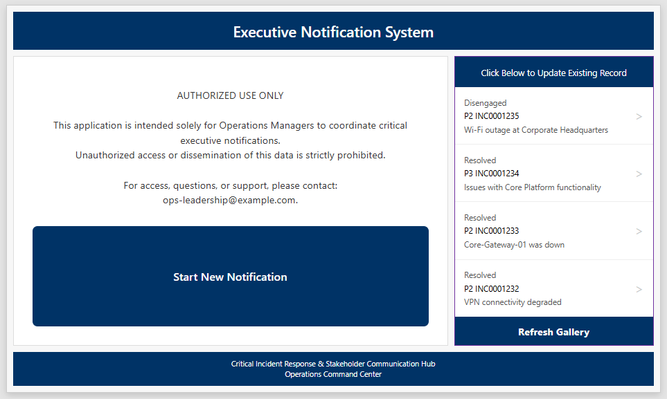
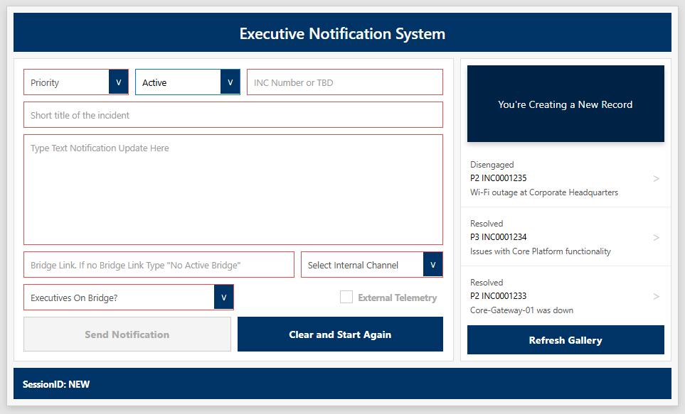
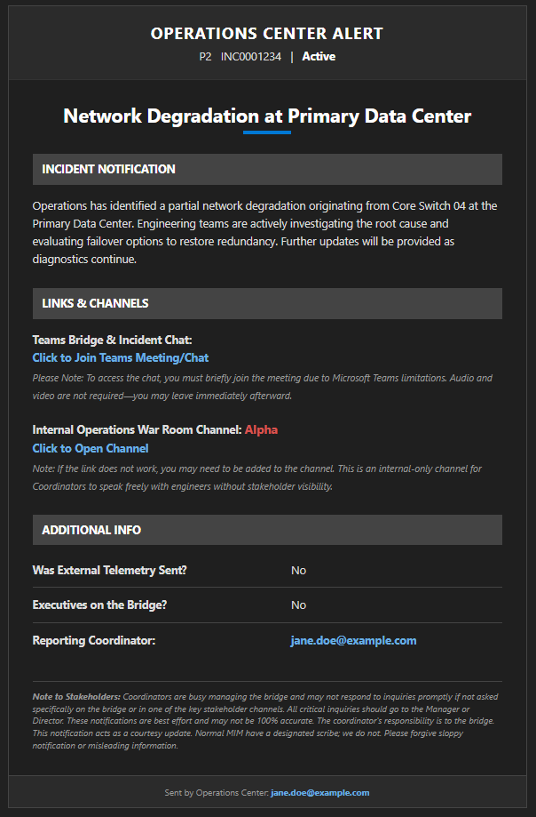
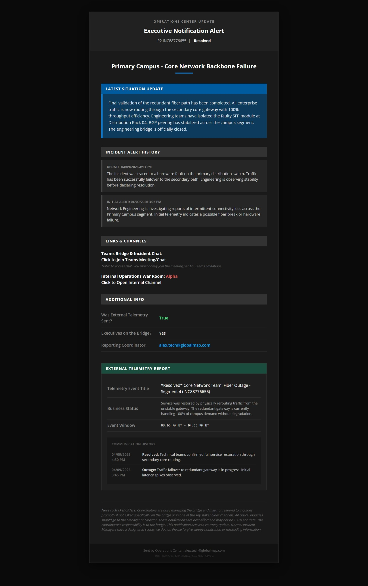
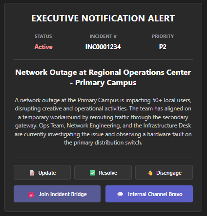
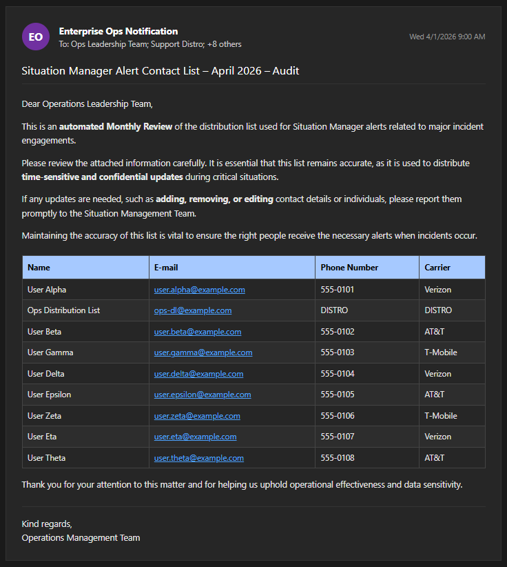

# Executive Notification System (ENS)
### *Omnichannel Incident Communication — Engineered for Zero Cognitive Load*


---

> **Problem:** During a P1 outage, Major Incident Managers were spending 8–12 minutes per update manually drafting and sending stakeholder emails, SMS messages, and Teams pings — while simultaneously managing technical resolution on a live bridge.
>
> **Solution:** A single button. One dispatch. Every stakeholder informed in under 30 seconds via Email, SMS, and Teams — simultaneously.

---

## Screenshots

| Start Screen | Control Panel |
|:---:|:---:|
|  |  |

| Executive Email (Active) | Executive Email (Resolved) |
|:---:|:---:|
|  |  |

| Teams Adaptive Card | Monthly Audit Email |
|:---:|:---:|
|  |  |

---

## Business Case

In a Global Managed Service Provider (MSP) environment, a single P1 outage can simultaneously impact hundreds of enterprise clients. The communication burden on incident responders — historically handled through manual copy-paste updates — introduced four compounding failure modes:

| Problem | Impact |
|---|---|
| **The "Bridge Tax"** | MIMs lost 8–12 minutes per cycle to manual formatting, pulled away from technical resolution |
| **Communication Inconsistency** | Shift-dependent quality meant executives received different levels of detail based on who was on duty |
| **Mean Time to Notify (MTTN)** | Manual broadcast created a 10–20 minute lag between incident discovery and stakeholder awareness |
| **Audit Trail Failure** | Manual messages left no structured paper trail for Post-Incident Reviews or SLA reporting |

The ENS eliminates all four failure modes with a single, integrated system.

---

## Key Features

### Unified Incident Control Panel (Power Apps)
A high-performance Canvas App engineered for speed under pressure.

- **The Validation Trap** — Intelligent UI logic prevents records from being submitted with incomplete data or placeholder priorities. Mandatory fields are dynamically highlighted with high-contrast red borders until valid data is detected.
- **The TBD Workflow** — When an incident is in early "Fog of War" and no INC number exists, the operator can dispatch an initial awareness notification with a `TBD` priority. The system locks the INC field to prevent the broadcast of inaccurate ticket numbers.
- **The P1 Visual Interrupt** — Selecting a Priority 1 classification triggers an active orange highlight to introduce deliberate "cognitive friction" — ensuring mobilization of executive leadership is always intentional.
- **Dynamic Stakeholder Mapping** — Streamlined interface for selecting which executive tiers or specific groups need to be notified based on the incident's scope and impact.

### Omnichannel Automated Engine (Power Automate)
A single trigger dispatches a coordinated communication blast across three channels in parallel:

- **High-Fidelity HTML Emails** — Professional, dark-mode-compatible branded templates featuring a cumulative incident history log. Every update *prepends* to the previous record, giving any stakeholder who joins mid-incident the complete timeline in a single email thread.
- **Teams Adaptive Cards** — Interactive cards embedded with `Action.OpenUrl` deep links, enabling authorized managers to trigger `Update`, `Resolve`, or `Disengage` actions directly from the Teams channel — with a single click.
- **Multi-Path SMS Delivery** — Dual-path redundancy via **Email-to-Text** carrier gateway routing AND **Twilio API** for registered contacts, ensuring reachability for off-site leadership regardless of connectivity constraints.

### SessionID Deep Link Architecture
*The most critical architectural decision in the system — and the least visible to the user.*

The ENS uses an immutable `SessionID` (GUID) as the primary key for every notification thread — decoupling the communication lifecycle from the volatile Incident Number.

- In multi-tenant MSP environments, customers may dictate their own INC numbers mid-incident. Traditional systems break when the key changes; the ENS does not.
- Deep links embedded in Teams cards and emails carry the `SessionID` and an `Action` parameter back into Power Apps, bypassing the home screen entirely and pre-configuring the Control Panel with the correct session state.
- The `IncidentNotificationLogger` SharePoint list serves as the authoritative, persistent source of truth for all session state.

See [`/Docs/SessionID.md`](./Docs/SessionID.md) for the full architectural analysis.

### Governance & Automated Auditing
A recurring Power Automate flow executes on the 1st of every month at 09:00 AM.

- Extracts the live stakeholder contact roster from SharePoint.
- Formats it into a styled HTML grid containing Name, Email, Phone Number, and Carrier.
- Broadcasts the audit report to organizational leadership for review, enforcing data hygiene and least-privilege access without any manual intervention.

See [`/Docs/Monthly_Stakeholder-Contact-Audit-Flow.md`](./Docs/Monthly_Stakeholder-Contact-Audit-Flow.md) for details.

### 📡 External Provider Sync (Asynchronous Listener Flow)
A background flow monitors a dedicated inbox for incoming alert emails from third-party vendors.

- Auto-parses incoming emails to extract Incident status, affected segments, and timestamps.
- Writes parsed data to the External Telemetry SharePoint list.
- When the Main Flow detects a telemetry match for the active INC number, it automatically flags the event as an "Official Major Incident" in the UI and dynamically injects a formatted telemetry report section into the executive email.

---

## System Architecture

```
┌─────────────────────────────────────────────────────────┐
│                   UI Layer (Power Apps)                 │
│         Home Screen ──────► Control Panel               │
│         (Gallery + Deep Link Bypass)   (Dispatch UI)    │
└──────────────────────────┬──────────────────────────────┘
                           │ JSON Payload via PA Connector
┌──────────────────────────▼──────────────────────────────┐
│            Orchestration Layer (Power Automate)         │
│  ┌────────────┐  ┌──────────────────┐  ┌─────────────┐  │
│  │ Main Flow  │  │ Provider Listener│  │  Audit Flow │  │
│  │ (Triggered)│  │  (Email Trigger) │  │ (Recurrence)│  │
│  └─────┬──────┘  └────────┬─────────┘  └──────┬──────┘  │
└────────┼──────────────────┼────────────────────┼────────┘
         │                  │                    │
┌────────▼──────────────────▼────────────────────▼────────┐
│              Data Layer (SharePoint Online)             │
│   Incident Tracker │ External Telemetry │ Contact List  │
└──────────────────────────┬──────────────────────────────┘
                           │
┌──────────────────────────▼──────────────────────────────┐
│               Delivery Layer                            │
│    O365 Outlook  │  MS Teams  │  Twilio / Email-to-Text │
└─────────────────────────────────────────────────────────┘
```

---

## Repository Structure

```
/
├── App-UI/
│   ├── App_pa.yaml                  # App-level routing, OnStart, deep link ingestion
│   ├── Screen_Home_pa.yaml          # Home screen gallery & provisioning logic
│   └── Screen_ControlPannel_pa.yaml # Control panel validation, dispatch, and lockout
│
├── Automations/
│   ├── ExecutiveNotificationAppCollector-[ID].json  # Main omnichannel notification flow
│   └── [Audit & Provider Sync flows]
│
├── Docs/
│   ├── README.md                         # This file
│   ├── Main-Flow.md                      # Core flow architecture & deployment guide
│   ├── Main-Flow-Diagram.md              # Full Mermaid flow diagram
│   ├── Dynamic_Email_Architecture.md     # Modular HTML email template engineering
│   ├── Adaptive_Cards.md                 # Teams card deep link architecture
│   ├── SessionID.md                      # Case for SessionID over Incident Numbers
│   ├── ENS_Start_Screen.md               # Start screen UX logic & Power Fx
│   ├── ENS_Communication_Control_Panel.md # Control panel behavioral logic
│   ├── Monthly_Stakeholder-Contact-Audit-Flow.md  # Governance flow docs
│   └── SMS-A2P.md                        # 10DLC compliance & proof of consent policy
│
└── img/
    ├── ENS_UI_StartScreen.png
    ├── ENS_UI_CommsScreen.png
    ├── Email_Active_Communication.png
    ├── Email_Resolved_Communication.png
    ├── ENS_Channel_Card_Notification.png
    └── ENS_Email_Audit_Report.png
```

---

## Technology Stack

| Layer | Technology | Purpose |
|---|---|---|
| **UI** | Power Apps (Canvas) | Incident intake, validation, operator control surface |
| **Orchestration** | Power Automate Cloud Flows | Multi-channel dispatch, state management, governance |
| **Data** | SharePoint Online | Incident Tracker, Contact Roster, External Telemetry |
| **Email** | Office 365 Outlook | HTML executive alerts, Email-to-Text SMS gateway |
| **Chat** | Microsoft Teams | Adaptive Cards with stateful deep links |
| **SMS** | Twilio (REST API) | A2P 10DLC registered SMS for registered contacts |
| **Logic** | Power Fx, JSON, OData, HTML/CSS | Validation, routing, templating, data filtering |

---

## Deployment Guide

### Prerequisites
- Power Apps environment with premium connectors enabled
- SharePoint Online site with the following lists provisioned:
  - `ExecutiveNotificationTracker` — Session and incident state
  - `IncidentNotificationLogger` — Persistent history log
  - `StakeholderContacts` — Contact roster (Name, Email, Phone, Carrier)
  - `ExternalTelemetry` — Provider alert sync target
- Twilio account with A2P 10DLC campaign registered (see [`/Docs/SMS-A2P.md`](./Docs/SMS-A2P.md))
- Shared Office 365 mailbox with Send-As permissions

### Steps

**1. Import the Flow Package**
Import `ExecutiveNotificationAppCollector-[ID].json` into your Power Automate environment.

**2. Re-establish Connections**
Authenticate the following connectors:
- `shared_office365` — Authorized sender or shared mailbox
- `shared_sharepointonline` — Read/write to all four lists
- `shared_teams` — Access to target operational channels
- `shared_twilio` — API key and registered sender number

**3. Update Environment Variables**
- Replace Teams channel deep link URLs in the Internal Channel Map compose block
- Update Adaptive Card URL parameters:
  - `{TenantID}` — Your Azure AD tenant
  - `{AppID}` — Your published Power App's App ID

**4. Import the Power App**
Import the YAML source files from `/App-UI/` into your Power Apps environment via the Studio.

**5. Activate & Test**
- Toggle the flow **ON**
- Run a test trigger from Power Apps
- Validate Email delivery, Teams card posting, and SMS dispatch

---

## SMS Compliance (10DLC / A2P)

This system is architected to comply with TCPA, CTIA, GDPR, and ISO/IEC 27001 (Control 5.24) requirements for enterprise operational SMS.

A complete, carrier-submission-ready **Proof of Consent** policy document is included at [`/Docs/SMS-A2P.md`](./Docs/SMS-A2P.md). This document covers:

- Regulatory framework alignment
- Implied consent mechanism for operational personnel
- Onboarding / offboarding procedures
- Sample message content and frequency disclosures
- Data privacy and use restrictions

---

## Security & Governance

- **Authorized Use Only** — The application surface displays a compliance banner on every screen, reinforcing that the tool handles executive-level, confidential operational data.
- **Least Privilege** — The monthly audit flow prompts leadership to revoke access for individuals who no longer require visibility.
- **Audit Trail** — Every notification session is logged to `IncidentNotificationLogger` with timestamps, operator identity, and full message history, enabling complete Post-Incident Review (PIR) reconstruction.
- **Session Isolation** — The immutable SessionID architecture prevents data leakage between concurrent incidents or operator sessions.

---

## Design Philosophy

The ENS was built around a single constraint: **the operator cannot afford cognitive overhead during a crisis.**

Every design decision — from the mandatory state check on the home screen, to the interface lockout during dispatch, to the color-coded priority fields — was made to reduce decision fatigue, prevent input errors, and enforce professional output under conditions of maximum operational pressure.

The system doesn't just send notifications. It manages incident state, enforces data quality, maintains a living audit trail, and ensures that every stakeholder receives an identical, professional narrative — regardless of who is managing the bridge.

---

## 📄 License

This project is licensed under the MIT License. See [LICENSE](./LICENSE) for details.

---

*Built and maintained by Daniel Weber — IT Service Management / Incident Response Engineering*
